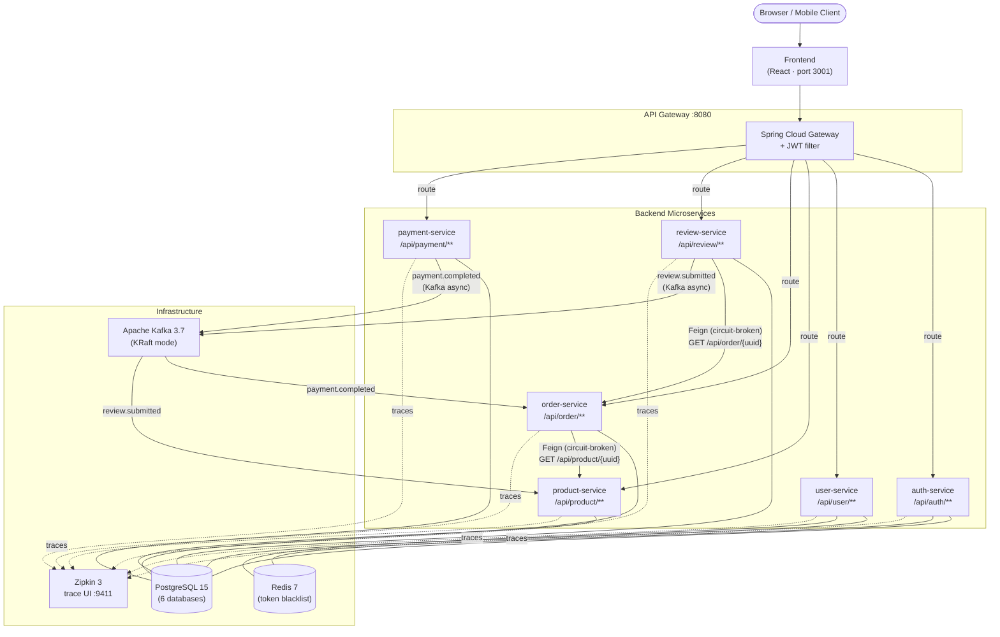

# E-Commerce Backend

A production-ready microservices backend for an e-commerce platform, built with **Spring Boot 3.2**, **Spring Cloud 2023**, **Kafka**, **Resilience4j**, and **distributed tracing via Zipkin**.

---

## Architecture



---

## Services

| Service | Port (internal) | Responsibility |
|---|---|---|
| **api-gateway** | 8080 | Single entry point, JWT validation, routing |
| **auth-service** | 8080 | Register, login, logout, token refresh |
| **user-service** | 8080 | User profile CRUD |
| **product-service** | 8080 | Product catalogue, stock management, average rating |
| **order-service** | 8080 | Order lifecycle (PENDING → PROCESSING → DELIVERED) |
| **review-service** | 8080 | Review creation & listing (verified buyers only) |
| **payment-service** | 8080 | Payment initiation & status |

---

## Communication Patterns

### Synchronous — OpenFeign + Resilience4j circuit breaker

| Caller | Callee | Purpose |
|---|---|---|
| order-service | product-service | Fetch product details, reduce stock |
| review-service | order-service | Verify the buyer received the order |

Feign clients share an `X-Internal-Secret` header injected by a `RequestInterceptor` so internal endpoints are not callable directly.  
Circuit breakers are configured with a 50 % failure-rate threshold and a 5-second wait in open state.

### Asynchronous — Kafka topics

| Topic | Producer | Consumer | Trigger |
|---|---|---|---|
| `payment.completed` | payment-service | order-service | Payment finished → update order status |
| `review.submitted` | review-service | product-service | New review → recalculate average rating |

---

## Tech Stack

| Concern | Technology |
|---|---|
| Language | Java 17 |
| Framework | Spring Boot 3.2.5 |
| Service discovery / routing | Spring Cloud Gateway 2023.0.1 |
| Inter-service calls | OpenFeign + Resilience4j |
| Async messaging | Apache Kafka 3.7 (KRaft) |
| Auth | Spring Security + JWT (JJWT 0.11) |
| Persistence | Spring Data JPA + PostgreSQL 15 |
| Caching / token blacklist | Redis 7 |
| Distributed tracing | Micrometer + Brave → Zipkin 3 |
| API docs | SpringDoc OpenAPI (Swagger UI) |
| Tests | JUnit 5, Mockito, Testcontainers |
| CI/CD | GitHub Actions |
| Containerisation | Docker + Docker Compose |

---

## Quick Start

### Prerequisites
- Docker ≥ 24 and Docker Compose v2
- (Optional) JDK 17 + Maven 3.9 for local builds

### Run everything

```bash
git clone https://github.com/<your-org>/ecommerce-backend.git
cd ecommerce-backend
docker compose up --build
```

| URL | Description |
|---|---|
| `http://localhost:8080` | API Gateway (all requests go here) |
| `http://localhost:8080/swagger-ui.html` | Swagger UI |
| `http://localhost:9411` | Zipkin trace dashboard |
| `http://localhost:3001` | React frontend |

### Run tests locally

```bash
./mvnw clean verify
```

Testcontainers automatically starts ephemeral PostgreSQL and Kafka containers for integration tests — no external services required.

---

## API Reference

All routes are proxied through `http://localhost:8080`.  
Protected endpoints require `Authorization: Bearer <token>`.

### Auth  `/api/auth`

| Method | Path | Auth | Description |
|---|---|---|---|
| POST | `/api/auth/register` | No | Register a new user |
| POST | `/api/auth/login` | No | Login, returns JWT |
| POST | `/api/auth/logout` | Yes | Invalidate token |
| POST | `/api/auth/refresh` | No | Refresh access token |

### Users  `/api/user`

| Method | Path | Auth | Description |
|---|---|---|---|
| GET | `/api/user/me` | Yes | Current user profile |
| PUT | `/api/user/me` | Yes | Update profile |
| DELETE | `/api/user/me` | Yes | Soft-delete account |

### Products  `/api/product`

| Method | Path | Auth | Description |
|---|---|---|---|
| GET | `/api/product` | No | List products (paginated) |
| GET | `/api/product/{uuid}` | No | Get product detail |
| POST | `/api/product` | Seller | Create product |
| PUT | `/api/product/{uuid}` | Seller (owner) | Update product |
| DELETE | `/api/product/{uuid}` | Seller (owner) | Delete product |

### Orders  `/api/order`

| Method | Path | Auth | Description |
|---|---|---|---|
| POST | `/api/order` | Buyer | Place an order |
| GET | `/api/order/{uuid}` | Yes | Get order detail |
| GET | `/api/order/my` | Buyer | List my orders |
| PUT | `/api/order/{uuid}/status` | Seller / Admin | Advance order status |

### Reviews  `/api/review`

| Method | Path | Auth | Description |
|---|---|---|---|
| POST | `/api/review` | Buyer | Submit a review (order must be DELIVERED) |
| GET | `/api/review/product/{productUuid}` | No | List reviews for a product |

### Payments  `/api/payment`

| Method | Path | Auth | Description |
|---|---|---|---|
| POST | `/api/payment` | Buyer | Initiate payment for an order |
| GET | `/api/payment/{uuid}` | Buyer | Get payment status |

---

## Project Structure

```
ecommerce-backend/
├── api-gateway/          # Spring Cloud Gateway + JWT filter
├── auth-service/         # Authentication & token management
├── user-service/         # User profile management
├── product-service/      # Product catalogue & stock
├── order-service/        # Order lifecycle
├── review-service/       # Product reviews
├── payment-service/      # Payment processing
├── init.sql              # PostgreSQL schema bootstrap
├── docker-compose.yml    # Full local stack
└── pom.xml               # Parent POM (all modules)
```

---

## Configuration

All secrets are managed via `x-common-env` in `docker-compose.yml`.  
For production, replace with Docker secrets or a secrets manager.

| Variable | Default | Purpose |
|---|---|---|
| `DB_USERNAME` | `postgres` | Database user |
| `DB_PASSWORD` | `postgres` | Database password |
| `JWT_SECRET` | *(set in compose)* | HS256 signing key |
| `INTERNAL_SECRET` | *(set in compose)* | Service-to-service header |
| `KAFKA_BOOTSTRAP_SERVERS` | `kafka:9092` | Kafka broker |
| `ZIPKIN_URL` | `http://zipkin:9411/api/v2/spans` | Trace endpoint |

---

## CI/CD

GitHub Actions workflow at [.github/workflows/build.yml](.github/workflows/build.yml):

1. **build** job — runs on every push / PR to `master`:
   - Compiles all modules from the parent POM
   - Executes unit tests (Mockito) and integration tests (Testcontainers)
   - Uploads Surefire reports as build artifacts

2. **docker-build** job — runs on direct pushes only:
   - Builds Docker image for each of the 7 services in a matrix
   - Uses GitHub Actions layer cache for fast rebuilds

---

## License

MIT
